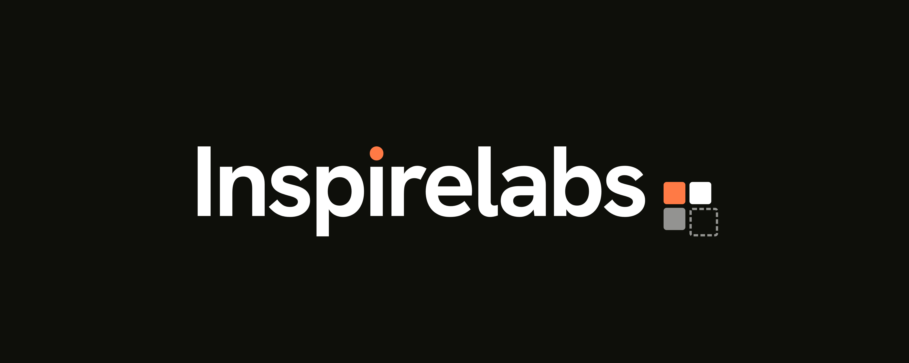

<p align="center">
  
</p>

<h1 align="center">Project Synapse</h1>
<p align="center"><em>An <a href="https://www.inspirelabs.in">Inspirelabs</a> open-source project.</em></p>

<p align="center">
  <a href="LICENSE"></a>
  <a href="CONTRIBUTING.md"></a>
  
  
  
</p>

**An AI-powered codebase intelligence, visual topology, and product-blueprinting engine.**

Synapse ingests source code, builds an absolute Abstract Syntax Tree (AST) dependency graph, and marries it with a vector semantic layer — letting you visually explore, chat with, and map capability reuse across your engineering assets through a neuroscience-inspired interface.

---

## Features

| Module | What it does |
| --- | --- |
| **Cortex Perspectives** | Toggle the canvas between an *Executive* (folders / macro-flows) and *Synaptic* (deep AST: file cards + `ƒ` function anchors) zoom depth. |
| **Axon Pathways** | Dependency-sorted, topological code walkthroughs with fluid GSAP camera-fly onboarding tours. |
| **Dendrite Callouts** | Contextual markers for complex idioms (closures, HOFs, decorators, transactional blocks). |
| **Myelin Insulation** | Ingests Markdown / `/docs` wikis, vectorizes them, and overlays human docs onto the code graph. |
| **Synaptic Pruning** | Confidence-tiered dead / unreachable code detection (orphan files, unused exports/functions) with evidence. |
| **Bug & Anti-Pattern Engine** | Two-tier diagnostics: deterministic graph scans (circular deps via Tarjan SCC, resource leaks) + an adversarial LLM red-team pass over pgvector-retrieved context. Surfaced in a hacker-terminal dashboard. |
| **RAG Chat + Blueprints** | Hybrid vector + structural retrieval to answer questions and discover reusable capability blueprints. |

Multi-language parsing: **TypeScript / JavaScript** (real `tsc` AST via a Node sub-process), **Go** (`go/parser`), **Rust** (lexical item scanner), and **Python** (lexical, indentation-aware scanner — imports, defs/classes, decorators & Flask/FastAPI routes).

---

## Tech Stack

- **Backend** — Go (concurrent AST ingestion, RAG, graph + diagnostics engines) over `pgx`.
- **Frontend** — Next.js 16 (App Router, TypeScript), a d3-powered graph canvas (force *galaxy* + *radial* layouts), React Flow for the architecture diagram, GSAP motion, Tailwind v4.
- **Data** — PostgreSQL 16 + `pgvector` (HNSW) + `pg_trgm`, via Docker.
- **Auth** — Auth.js (next-auth) with a frictionless "Continue as Local Developer" bypass for local use.

```
backend/    Go modules — ingestion, parsers, RAG, graph, prune, bugs, HTTP API
frontend/   Next.js app — canvas, workspace panels, diagnostics terminal
docker/     docker-compose (Postgres + pgvector) + schema init SQL
docs/       Architecture logs & system schemas
```

---

## Quickstart

**Prerequisites:** Docker, Go 1.26+, Node 20+.

### 1. Install dependencies
Installs the Go modules, the frontend packages, **and the TypeScript parser subprocess deps** (without which `.ts`/`.tsx` ingestion fails):
```bash
make setup                  # macOS / Linux / Windows-with-make
# Windows without make:
.\setup.ps1
```

### 2. Start the database
```bash
make db-up                  # or: cd docker && docker compose up -d
```

### 3. Configure
```bash
cp backend/.env.example backend/.env          # set provider keys (or run offline)
cp frontend/.env.example frontend/.env.local  # optional: OAuth; defaults work locally
```
The app runs **100% offline** with no keys (deterministic embeddings + a template LLM responder). Add an embedding/LLM provider key in `backend/.env` to enable the semantic layer, docs, and the Tier-2 bug analysis. See `backend/.env.example` for every option.

### 4. Run the backend
```bash
cd backend
./run.ps1                   # Windows: loads .env, then `go run ./cmd/server`
# or, cross-platform, export the vars and:  go run ./cmd/server
```
API listens on `http://localhost:8080`.

### 5. Run the frontend
```bash
cd frontend
npm run dev                 # next dev --webpack  →  http://localhost:3000
```

Open http://localhost:3000, click **Continue as Local Developer**, and ingest a local repository path to build its graph.

---

## Configuration

All backend config is environment-driven (`backend/internal/config`). Copy `backend/.env.example` and set what you need — database URL, ingestion root, embedding/LLM provider + keys, RAG tuning, and bug-scan options (`SYNAPSE_BUGS_LLM`, `SYNAPSE_BUGS_MAX_LLM`).

> **Secrets:** real `.env` / `.env.local` files are gitignored. Never commit API keys — only the `.env.example` templates are tracked.

---

## Development

Common tasks are wrapped in the `Makefile` (run `make help` for the full list):

| Command | Does |
| --- | --- |
| `make setup` | install all dependencies (Go, frontend, TS parser) |
| `make db-up` / `make db-down` | start / stop the Postgres + pgvector container |
| `make build` | build backend + frontend |
| `make test` | `go test ./...` + frontend `tsc --noEmit` |

Or run them directly:
```bash
# Backend
cd backend && go build ./... && go test ./...

# Frontend
cd frontend && npx tsc --noEmit && npm run lint
```

> On Windows without `make`, use `.\setup.ps1` for the setup step; the rest are one-line commands above.

---

## Contributing

Contributions are very welcome — bug fixes, features, parsers, and docs. Start
with [**CONTRIBUTING.md**](CONTRIBUTING.md) for the dev setup and guidelines, and
please open an issue before large changes. All participants are expected to
follow our [Code of Conduct](CODE_OF_CONDUCT.md).

Found a security issue? Please report it privately — see [SECURITY.md](SECURITY.md).

## A note on deployment

Synapse is built as a **local-first, single-tenant** tool. The HTTP API and CORS
are intentionally open for local use, and the "Continue as Local Developer"
sign-in is a convenience for running it on your own machine. If you expose it
beyond `localhost`, put it behind authentication and a network boundary first.

## License

Released under the [MIT License](LICENSE). © 2026 [Inspirelabs](https://www.inspirelabs.in).

<p align="center">
  <br>
  
  <br>
  <sub>Built by the AI Labs team at Inspirelabs.</sub>
</p>
